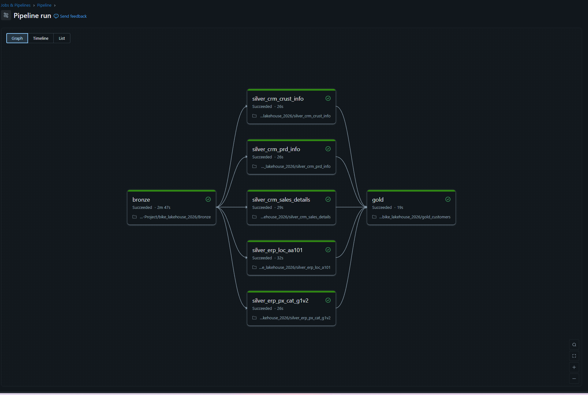

# Databricks Lakehouse Project (Bronze -> Silver -> Gold) — bike_lakehouse_2026

A practical Databricks Lakehouse / Medallion Architecture project built in the Databricks Free Edition using Unity Catalog Delta Lake PySpark and Spark SQL Built with the purpose of getting to know the Databricks Architecture.
**Project Design and Pipeline screenshots are in the asset folder.**

This pipeline ingests raw CSV files into Bronze, cleans/standardizes into Silver, and produces an analytics-ready Gold dimension table with customer + location enrichment + sales rollups.
---
### Pipeline Screenshots (Databricks Workflow)

### Architecture Diagram


**Timeline view**


**Graph view**


**Task list view**


---

## Table of Contents
- [Project Goals]
- [Architecture]
- [Pipeline Run Order]
- [Repo Contents]
- [Data Model]
  - [Bronze Tables]
  - [Silver Tables]
  - [Gold Tables]
- [Notebook Details]
  - [Bronze Ingestion (Config-Driven)]
  - [Silver: CRM Customers]
  - [Silver: CRM Products]
  - [Silver: CRM Sales]
  - [Silver: ERP Customer Location]
  - [Silver: ERP Product Category]
  - [Gold: Customer Dimension]
- [Debugging Story: CAST_INVALID_INPUT]
- [Free Edition Constraints & Design Choices]
- [Lessons Learned]
---

## Project Goals
- Build a complete Bronze → Silver → Gold Lakehouse pipeline in Databricks
- Use Delta tables + Unity Catalog schemas to enforce structure
- Demonstrate clean transformations (trimming, normalization, casting, derived fields)
- Show real debugging of Spark issues (not just happy path)
- Refactor ingestion from manual copy/paste to config-driven scaling

---

## Architecture

### Medallion Design
- **Bronze (Raw)**  
  CSV → Delta tables with minimal transformation (as close to source as possible)
- **Silver (Clean/Conformed)**  
  Data cleaning, normalization, renaming, type casting, and join-safety
- **Gold (Business-ready)**  
  Customer dimension with enrichment and aggregated sales metrics

> This project uses **Unity Catalog context** (`USE CATALOG workspace; USE SCHEMA bronze;`) so tables land in the correct place.

---

## Pipeline Run Order

**Bronze** → **Silver (5 notebooks)** → **Gold**

1. `Bronze.ipynb`
2. `silver_crm_crust_info.ipynb`
3. `silver_crm_prd_info.ipynb`
4. `silver_crm_sales_details.ipynb`
5. `silver_erp_loc_a101.ipynb`
6. `silver_erp_px_cat_g1v2.ipynb`
7. `gold_customers.ipynb`

> In Databricks Workflows, each Silver task depends on Bronze, and Gold depends on all Silver tasks.

---

## Repo Contents

```
bike_lakehouse_2026/
  Bronze.ipynb
  bronze_config.py
  silver_crm_crust_info.ipynb
  silver_crm_prd_info.ipynb
  silver_crm_sales_details.ipynb
  silver_erp_loc_a101.ipynb
  silver_erp_px_cat_g1v2.ipynb
  gold_customers.ipynb
```

---

## Data Model

### Bronze Tables
Created by `Bronze.ipynb` (CSV → Delta):
- `bronze.crm_cust_info_raw`
- `bronze.crm_prd_info_raw`
- `bronze.crm_sales_details_raw`
- `bronze.erp_cust_az12_raw` *(ingested; not modeled yet in Silver in current version)*
- `bronze.erp_loc_a101_raw`
- `bronze.erp_px_cat_g1v2_raw`

### Silver Tables
Created by the Silver notebooks:
- `silver.crm_customers`
- `silver.crm_products`
- `silver.crm_sales`
- `silver.erp_customer_location`
- `silver.erp_product_category`

### Gold Tables
Created by `gold_customers.ipynb`:
- `gold.dim_customers`

---

## Notebook Details

## 1) Bronze Ingestion (Config-Driven)

### Files
- `Bronze.ipynb`
- `bronze_config.py`

### Purpose
Ingest multiple CSV files from **Volumes** into Bronze Delta tables using a single loop.

### Why config-driven?
My first approach was manual (one file at a time), it worked, but it doesn’t scale.  
With a config file, adding a new source becomes **one new dictionary entry**, not new ingestion code.

### Bronze initialization
```python
# Import the bronze_config file (each dict = one CSV -> one table)
from bronze_config import INGESTION_CONFIG
```

### Unity Catalog context
```sql
USE CATALOG workspace;
USE SCHEMA bronze;
```

### Ingestion loop (CSV → Delta)
```python
for item in INGESTION_CONFIG:
    print(f"Ingesting {item['source']} → bronze.{item['table']}")

    df = (
        spark.read
             .option("header", "true")
             .option("inferSchema", "true")
             .csv(item["path"])
    )

    (
        df.write
          .mode("overwrite")
          .format("delta")
          .saveAsTable(f"bronze.{item['table']}")
    )
```

### Config: `bronze_config.py`
Key design choices:
- Centralizes all raw ingestion paths and destination table names
- Makes ingestion consistent across CRM and ERP sources
- Keeps lineage clear (source system → raw table)

---

## 2) Silver: CRM Customers

### File
- `silver_crm_crust_info.ipynb` 

### Reads
- `workspace.bronze.crm_cust_info_raw`

### Writes
- `workspace.silver.crm_customers`

### Transformations
- **Trim** whitespace across all string columns (join/filter safety)
- **Normalize codes**:
  - marital status `S/M` → `Single/Married`
  - gender `F/M` → `Female/Male`
  - everything else → `n/a`
- **Rename columns** using a mapping (raw → standardized)

---

## 3) Silver: CRM Products

### File
- `silver_crm_prd_info.ipynb`

### Reads
- `workspace.bronze.crm_prd_info_raw`

### Writes
- `silver.crm_products`

### Transformations
- Trim whitespace on string columns
- **Derive category id** from `prd_key`
- Extract product-key portion
- Replace null product cost with `0`
- Normalize product line codes (`M/R/S/T`) to readable labels
- Cast `prd_start_dt` to a real `DateType`
- **Fix end date** using a window:
  - `prd_end_dt = lead(prd_start_dt) - 1 day` (per product key)
- Rename columns via mapping

---

## 4) Silver: CRM Sales

### File
- `silver_crm_sales_details.ipynb`

### Reads
- `workspace.bronze.crm_sales_details_raw`

### Writes
- `silver.crm_sales`

### Transformations
- Trim whitespace on string columns
- Convert date fields stored as `yyyymmdd` into real dates
  - Invalid formats (0 or wrong length) → `NULL`
- Fix missing/invalid price:
  - If `price` is null or `<= 0`, compute:
    - `sales_amount / quantity` (when quantity ≠ 0)

---

## 5) Silver: ERP Customer Location

### File
- `silver_erp_loc_a101.ipynb`

### Reads
- `workspace.bronze.erp_loc_a101_raw`

### Writes
- `silver.erp_customer_location`

### Transformations
- Trim whitespace
- Standardize company id:
  - remove hyphens `-`
- Normalize country codes:
  - `DE` → `Germany`
  - `US/USA` → `United States`
  - blank/null → `n/a`

---

## 6) Silver: ERP Product Category

### File
- `silver_erp_px_cat_g1v2.ipynb`

### Reads
- `workspace.bronze.erp_px_cat_g1v2_raw`

### Writes
- `silver.erp_product_category`

### Transformations
- Trim whitespace
- Rename columns to standardized names:
  - `id` → `category_id`
  - `cat` → `category`
  - `subcat` → `subcategory`
  - `maintenance` → `maintenance_flag`

---

## 7) Gold: Customer Dimension

### File
- `gold_customers.ipynb`

### Reads (Silver)
- `silver.crm_customers`
- `silver.crm_sales`
- `silver.erp_customer_location`

### Writes
- `gold.dim_customers`

### Output columns (high level)
- Customer identity + attributes (name, marital status, gender, created date)
- Enrichment:
  - `country` (with fallback `n/a`)
- Metrics:
  - `total_orders`
  - `total_sales`
  - `total_units`

---

## Debugging Story: `CAST_INVALID_INPUT`

### What happened
While building Gold joins, Spark threw:

`[CAST_INVALID_INPUT] The value 'AW00011000' of type STRING cannot be cast to BIGINT`

### Root cause
Join key mismatch across Silver tables:
- `crm_customers.customer_id` contained **string IDs** (including alphanumeric like `AW00011000`)
- `crm_sales.customer_id` was typed as **INT**

Spark may try to reconcile the join by casting strings into numbers — which fails for alphanumeric IDs.

### Fix
Force all join keys into **STRING** inside CTEs before joining:
- `CAST(customer_id AS STRING)` everywhere

This guarantees **STRING-to-STRING** joins, prevents implicit numeric casting, and makes IDs like `AW00011000` valid.

---

## Free Edition Constraints & Design Choices

### Constraint: manual source ingestion
In Databricks Free Edition, the most reliable ingestion pattern is:
- upload CSV files into a **Volume**
- read them using `/Volumes/...` paths

### Design choice: config-driven ingestion
Instead of hardcoding file paths inside the notebook, ingestion is driven by `bronze_config.py` so:
- ingestion code stays stable
- adding a new file is just a config update
- switching write modes later is easy (`overwrite` → `append`, etc.)

---

## Lessons Learned
- **Manual ingestion works** but doesn’t scale — config-driven ingestion is essential.
- **Trimming string columns** early prevents “invisible” join/filter issues.
- **Implicit casting during joins is dangerous** — enforce types in Silver/Gold.
- **Real-world IDs are messy** (alphanumeric) — treat identifiers as strings unless you truly need numeric math.

---
