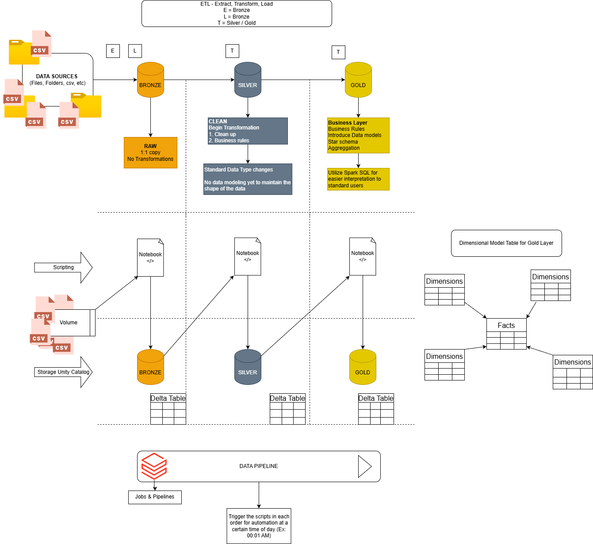
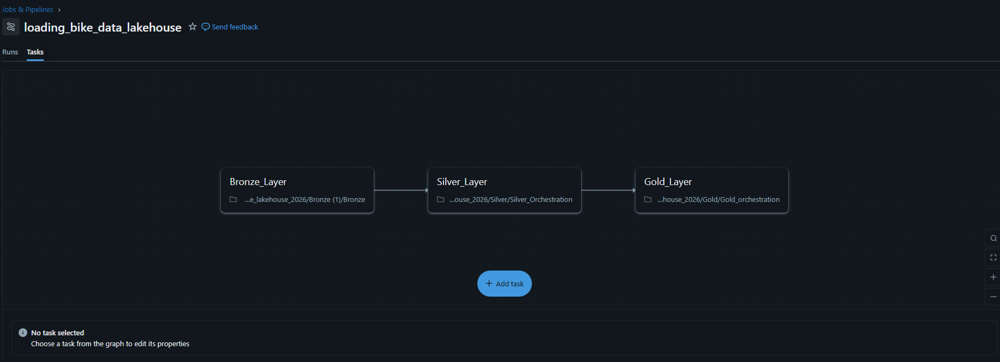

# Databricks Lakehouse Project (Bronze → Silver → Gold) — bike_lakehouse_2026

A practical Databricks Lakehouse / Medallion Architecture project built in **Databricks Free Edition** using **Unity Catalog**, **Delta Lake**, **PySpark**, and **Spark SQL**.

This pipeline ingests raw CSV files into **Bronze**, cleans/standardizes into **Silver**, and produces **analytics-ready Gold tables** (dimensions + fact) for BI/dashboarding.  
Project design + pipeline screenshots are in the `assets/` folder.

---

## Table of Contents
- [Project Goals](#project-goals)
- [Architecture](#architecture)
- [How to Run the Pipeline](#how-to-run-the-pipeline)
  - [Orchestration Notebooks](#orchestration-notebooks)
  - [Databricks Job](#databricks-job)
  - [Scheduling](#scheduling)
- [Pipeline Run Order](#pipeline-run-order)
- [Repo Contents](#repo-contents)
- [Data Model](#data-model)
- [Bronze Tables](#bronze-tables)
- [Silver Tables](#silver-tables)
- [Gold Tables](#gold-tables)
- [Notebook Details](#notebook-details)
  - [1) Bronze Ingestion (Config-Driven)](#1-bronze-ingestion-config-driven)
  - [2) Silver: CRM Customers](#2-silver-crm-customers)
  - [3) Silver: CRM Products](#3-silver-crm-products)
  - [4) Silver: CRM Sales](#4-silver-crm-sales)
  - [5) Silver: ERP Customer Location](#5-silver-erp-customer-location)
  - [6) Silver: ERP Product Category](#6-silver-erp-product-category)
  - [7) Silver: ERP Customers](#7-silver-erp-customers)
  - [8) Gold: Customer Dimension](#8-gold-customer-dimension)
  - [9) Gold: Product Dimension](#9-gold-product-dimension)
  - [10) Gold: Sales Fact](#10-gold-sales-fact)
- [Debugging Story: CAST_INVALID_INPUT](#debugging-story-cast_invalid_input)
- [Free Edition Constraints & Design Choices](#free-edition-constraints--design-choices)
- [Lessons Learned](#lessons-learned)

---

## Project Goals
- Build a complete **Bronze → Silver → Gold** Lakehouse pipeline in Databricks
- Use **Delta tables + Unity Catalog schemas** to enforce structure and organization
- Demonstrate clean transformations (trimming, normalization, casting, derived fields)
- Show real debugging of Spark issues (not just “happy path”)
- Refactor ingestion from manual copy/paste to a **config-driven** pattern that scales
- Add **orchestration notebooks + a Databricks Job** for clean, repeatable end-to-end runs

---

## Architecture

### Medallion Design
**Bronze (Raw)**
- CSV → Delta tables with minimal transformation (as close to source as possible)

**Silver (Clean/Conformed)**
- Data cleaning, normalization, renaming, type casting, and join-safety

**Gold (Business-ready)**
- Star-schema style model: customer/product dimensions + sales fact for analytics

This project uses Unity Catalog context (example):
```sql
USE CATALOG workspace;
USE SCHEMA bronze;
```
---

### System Design


---

## How to Run the Pipeline

### Orchestration Notebooks
To run each layer cleanly from a single entry point, this project uses **orchestration notebooks**.  
They call downstream notebooks in sequence using `dbutils.notebook.run()`.

- `silver_orchestration.ipynb` → runs all Silver transformation notebooks in order
- `gold_orchestration.ipynb` → runs all Gold notebooks in order

**Why orchestration helps**
- One-click runs for an entire layer (instead of manually running 6–9 notebooks)
- Clear ordering + consistent logging
- Easier Job setup (Bronze → Silver orchestration → Gold orchestration)

**Core orchestration pattern**
```python
dbutils.widgets.text("run_date", "")
run_date = dbutils.widgets.get("run_date")

TIMEOUT_SECONDS = 0
results = []

for nb in SILVER_NOTEBOOKS:
    print(f"\n=== Running: {nb} ===")
    try:
        out = dbutils.notebook.run(
            nb,
            timeout_seconds=TIMEOUT_SECONDS,
            arguments={"run_date": run_date}
        )
        results.append((nb, "SUCCESS", out))
        print(f" SUCCESS: {nb} | output: {out}")
    except Exception as e:
        results.append((nb, "FAILED", str(e)))
        print(f" FAILED: {nb}\n{e}")
        raise  # fail fast so downstream tables aren't built on partial upstream results
```

> Tip: add `dbutils.notebook.exit("ok")` at the end of each transformation notebook to make orchestration outputs cleaner.

---

### Databricks Job
A Databricks Job ties the full pipeline together using **three tasks**:

1. **Bronze task** → `Bronze.ipynb`
2. **Silver task** → `silver_orchestration.ipynb` (runs all Silver notebooks)
3. **Gold task** → `gold_orchestration.ipynb` (runs all Gold notebooks)

**Dependencies**
- Silver depends on Bronze
- Gold depends on Silver

This makes the pipeline fully repeatable from **Jobs & Pipelines → Jobs → Run now**.

---

### Workflow (Bronze → Silver → Gold)


---

### Scheduling
The same Job can be scheduled (e.g., daily). For early validation:
- monitor the first few scheduled runs
- review logs / outputs
- pause or adjust the schedule once stable

---

## Pipeline Run Order
Bronze → Silver → Gold

**Bronze**
- `Bronze.ipynb`

**Silver**
- `silver_orchestration.ipynb` (orchestration entry point)
  - `silver_crm_cust_info.ipynb`
  - `silver_crm_prd_info.ipynb`
  - `silver_crm_sales_details.ipynb`
  - `silver_erp_loc_a101.ipynb`
  - `silver_erp_px_cat_g1v2.ipynb`
  - `silver_erp_cust_az12.ipynb`

**Gold**
- `gold_orchestration.ipynb` (orchestration entry point)
  - `gold_customers.ipynb`
  - `gold_products.ipynb`
  - `gold_sales.ipynb`

---

## Repo Contents
```
bike_lakehouse_2026/
  Bronze.ipynb
  bronze_config.py

  silver_orchestration.ipynb
  silver_crm_cust_info.ipynb
  silver_crm_prd_info.ipynb
  silver_crm_sales_details.ipynb
  silver_erp_loc_a101.ipynb
  silver_erp_px_cat_g1v2.ipynb
  silver_erp_cust_az12.ipynb

  gold_orchestration.ipynb
  gold_customers.ipynb
  gold_products.ipynb
  gold_sales.ipynb

  assets/
    (system design + pipeline screenshots)
```

---

## Data Model
Gold is modeled for BI-friendly querying:

- `workspace.gold.dim_customers` (customer attributes + enrichment + rollups)
- `workspace.gold.dim_products` (product attributes + category enrichment)
- `workspace.gold.fact_sales` (sales grain = order line / order+product)

---

## Bronze Tables
Created by `Bronze.ipynb` (CSV → Delta):

- `workspace.bronze.crm_cust_info_raw`
- `workspace.bronze.crm_prd_info_raw`
- `workspace.bronze.crm_sales_details_raw`
- `workspace.bronze.erp_loc_a101_raw`
- `workspace.bronze.erp_px_cat_g1v2_raw`
- `workspace.bronze.erp_cust_az12_raw`

---

## Silver Tables
Created by Silver notebooks:

- `workspace.silver.crm_customers`
- `workspace.silver.crm_products`
- `workspace.silver.crm_sales`
- `workspace.silver.erp_customer_location`
- `workspace.silver.erp_product_category`
- `workspace.silver.erp_customers`  (from `erp_cust_az12_raw`)

---

## Gold Tables
Created by Gold notebooks:

- `workspace.gold.dim_customers`
- `workspace.gold.dim_products`
- `workspace.gold.fact_sales`

---

## Notebook Details

## 1) Bronze Ingestion (Config-Driven)
**Files**
- `Bronze.ipynb`
- `bronze_config.py`

**Purpose**
Ingest multiple CSV files from Volumes into Bronze Delta tables using a single loop.

**Why config-driven?**
Manual ingestion works but doesn’t scale. With config-driven ingestion, adding a new source is a config change (one new entry), not new ingestion code.

**Ingestion Loop (CSV → Delta)**
```python
from bronze_config import INGESTION_CONFIG

for item in INGESTION_CONFIG:
    df = (
        spark.read
             .option("header", "true")
             .option("inferSchema", "true")
             .csv(item["path"])
    )

    df.write.mode("overwrite").format("delta").saveAsTable(f"bronze.{item['table']}")
```

---

## 2) Silver: CRM Customers
**File**: `silver_crm_cust_info.ipynb`  
**Reads**: `workspace.bronze.crm_cust_info_raw`  
**Writes**: `workspace.silver.crm_customers`

**Transformations**
- Trim whitespace across all string columns (join/filter safety)
- Normalize codes:
  - marital status: `S/M → Single/Married`, else `n/a`
  - gender: `F/M → Female/Male`, else `n/a`
- Rename columns using mapping (raw → standardized)

---

## 3) Silver: CRM Products
**File**: `silver_crm_prd_info.ipynb`  
**Reads**: `workspace.bronze.crm_prd_info_raw`  
**Writes**: `workspace.silver.crm_products`

**Transformations**
- Trim whitespace on string columns
- Derive category id from product key
- Replace null product cost with `0`
- Normalize product line codes (M/R/S/T) to readable labels
- Cast start date to real `DateType`
- Fix end date using window (per product key): `lead(start_dt) - 1 day`
- Rename columns via mapping

---

## 4) Silver: CRM Sales
**File**: `silver_crm_sales_details.ipynb`  
**Reads**: `workspace.bronze.crm_sales_details_raw`  
**Writes**: `workspace.silver.crm_sales`

**Transformations**
- Trim whitespace on string columns
- Convert date fields stored as `yyyymmdd` into real dates
  - invalid formats (0 or wrong length) → NULL
- Fix missing/invalid price:
  - if price is null or <= 0, compute `sales_amount / quantity` when quantity ≠ 0

---

## 5) Silver: ERP Customer Location
**File**: `silver_erp_loc_a101.ipynb`  
**Reads**: `workspace.bronze.erp_loc_a101_raw`  
**Writes**: `workspace.silver.erp_customer_location`

**Transformations**
- Trim whitespace
- Standardize company id: remove hyphens `-`
- Normalize country codes (DE → Germany, US/USA → United States)
- blank/null → `n/a`

---

## 6) Silver: ERP Product Category
**File**: `silver_erp_px_cat_g1v2.ipynb`  
**Reads**: `workspace.bronze.erp_px_cat_g1v2_raw`  
**Writes**: `workspace.silver.erp_product_category`

**Transformations**
- Trim whitespace
- Rename columns:
  - `id → category_id`
  - `cat → category`
  - `subcat → subcategory`
  - `maintenance → maintenance_flag`

---

## 7) Silver: ERP Customers
**File**: `silver_erp_cust_az12.ipynb`  
**Reads**: `workspace.bronze.erp_cust_az12_raw`  
**Writes**: `workspace.silver.erp_customers`

**Transformations**
- Trim whitespace on all string columns
- Normalize gender codes (`M/F → Male/Female`, else `n/a`)
- Rename columns via mapping:
  - `GEN → Gender`
  - `CID → Customer_ID`
  - `BDATE → Birth_Date`

---

## 8) Gold: Customer Dimension
**File**: `gold_customers.ipynb`  
**Reads (Silver)**:
- `workspace.silver.crm_customers`
- `workspace.silver.crm_sales`
- `workspace.silver.erp_customer_location`

**Writes**
- `workspace.gold.dim_customers`

**Outputs (high level)**
- Customer identity + attributes (name, marital status, gender, created date)
- Enrichment: country (fallback `n/a`)
- Metrics: `total_orders`, `total_sales`, `total_units`

---

## 9) Gold: Product Dimension
**File**: `gold_products.ipynb`   
**Reads (Silver)**:
- `workspace.silver.crm_products`
- `workspace.silver.erp_product_category`

**Writes**
- `workspace.gold.dim_products`

**Outputs (high level)**
- Product identity + attributes (name, line, cost, etc.)
- Category enrichment from ERP mapping (category/subcategory)
- Deduping to ensure one row per product

---

## 10) Gold: Sales Fact
**File**: `gold_sales.ipynb`   
**Reads (Silver/Gold)**:
- `workspace.silver.crm_sales`
- `workspace.gold.dim_customers`
- `workspace.gold.dim_products`

**Writes**
- `workspace.gold.fact_sales`

**Outputs (high level)**
- Order-line grain sales table for analytics
- Keys: order, customer, product (+ surrogate keys if used)
- Metrics: sales_amount, quantity, unit price, extended amount
- Ready for dashboards: trends, category performance, customer AOV, etc.

---

## Debugging Story: CAST_INVALID_INPUT
**What happened**
While building Gold joins, Spark threw:

`[CAST_INVALID_INPUT] The value 'AW00011000' of type STRING cannot be cast to BIGINT`

**Root cause**
Join key mismatch across Silver tables:
- `crm_customers.customer_id` contained string IDs (including alphanumeric like `AW00011000`)
- `crm_sales.customer_id` was typed as INT  
Spark may try to reconcile joins by casting strings to numbers — which fails for alphanumeric IDs.

**Fix**
Force all join keys into STRING inside CTEs before joining:
```sql
CAST(customer_id AS STRING)
```
This guarantees STRING-to-STRING joins, prevents implicit numeric casting, and makes IDs like `AW00011000` valid.

---

## Free Edition Constraints & Design Choices
**Constraint: manual source ingestion**
In Databricks Free Edition, the most reliable ingestion pattern is:
- upload CSV files into a Volume
- read them using `/Volumes/...` paths

**Design choice: config-driven ingestion**
Rather than hardcoding file paths inside the notebook, ingestion is driven by `bronze_config.py` so:
- ingestion code stays stable
- adding a new file is just a config update
- switching write modes later is easy (overwrite → append, etc.)

---

## Lessons Learned
- Manual ingestion works but doesn’t scale — config-driven ingestion is essential.
- Trimming string columns early prevents “invisible” join/filter issues.
- Implicit casting during joins is dangerous — enforce types in Silver/Gold.
- Real-world IDs are messy (alphanumeric) — treat identifiers as strings unless you truly need numeric math.
- Orchestration notebooks make the pipeline reproducible and Job-friendly (one entry point per layer).
- Jobs + dependencies provide a clean “production-style” run flow, even in Free Edition.

## Data Source
Sample dataset provided by **DataWithBaraa** (used for educational purposes).
